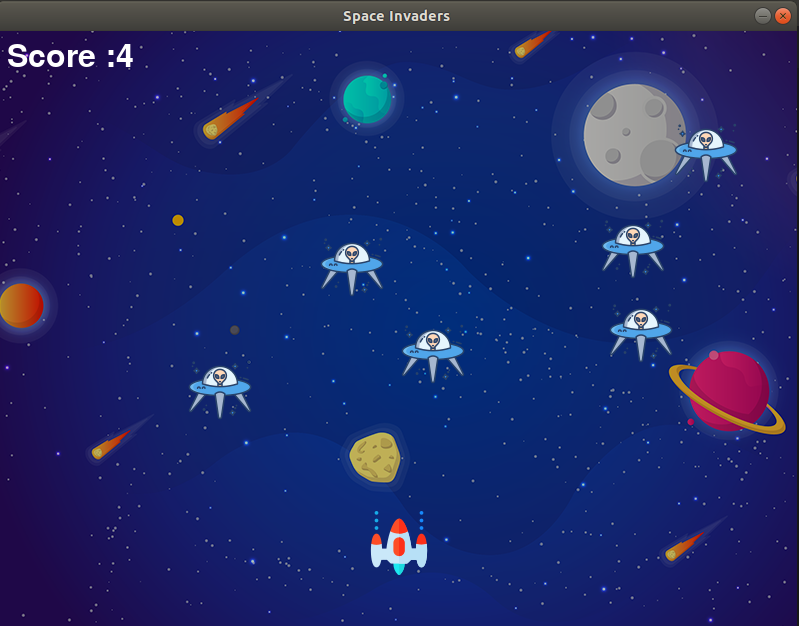

# Space-Invader
A Pygame Application

  

## Running
* `python3 main.py`

## Keys for Playing
* Left-arrow for left movement of SpaceShip
* Rigth-arrow for rigth movement of SpaceShip
* Space-bar to fire bullets 

## Requirements
* Ubuntu 18.04
* Python 3.7
* Pygame 1.9.6 
